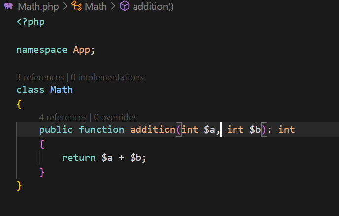
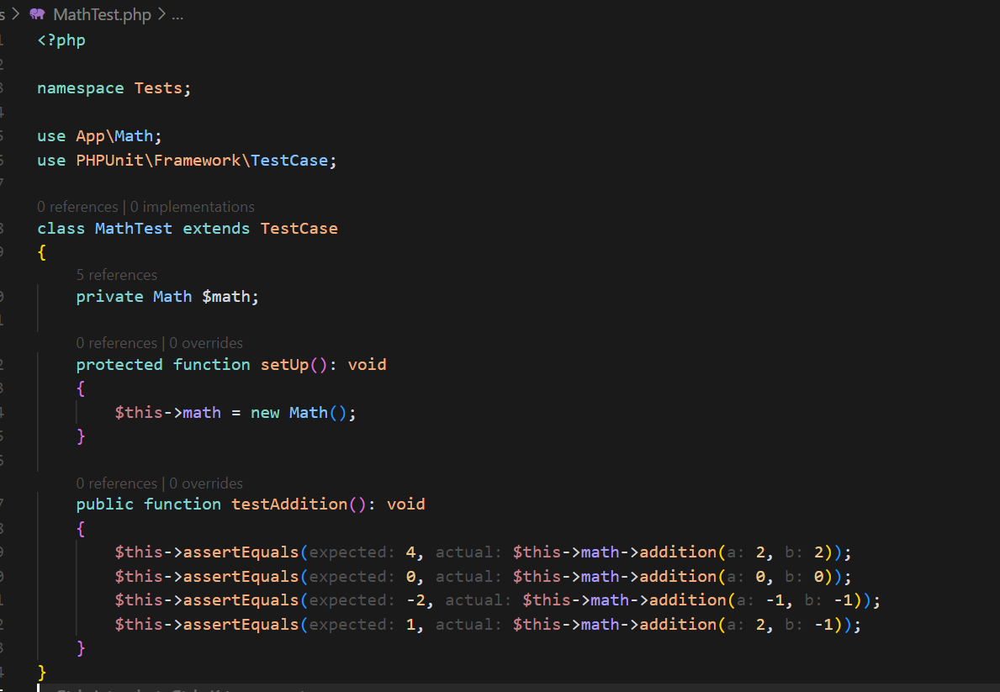
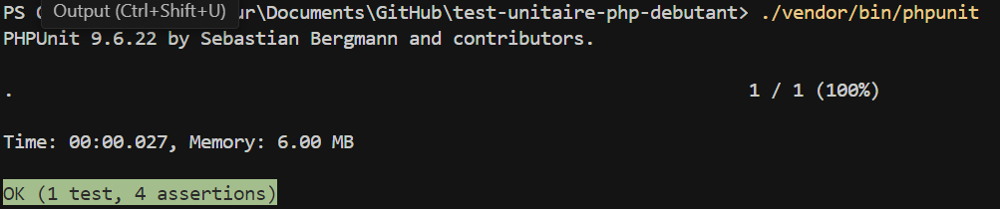
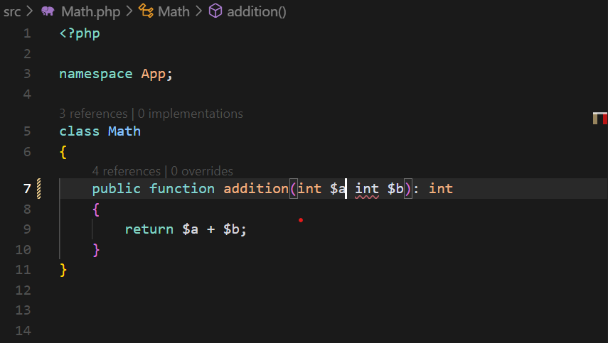
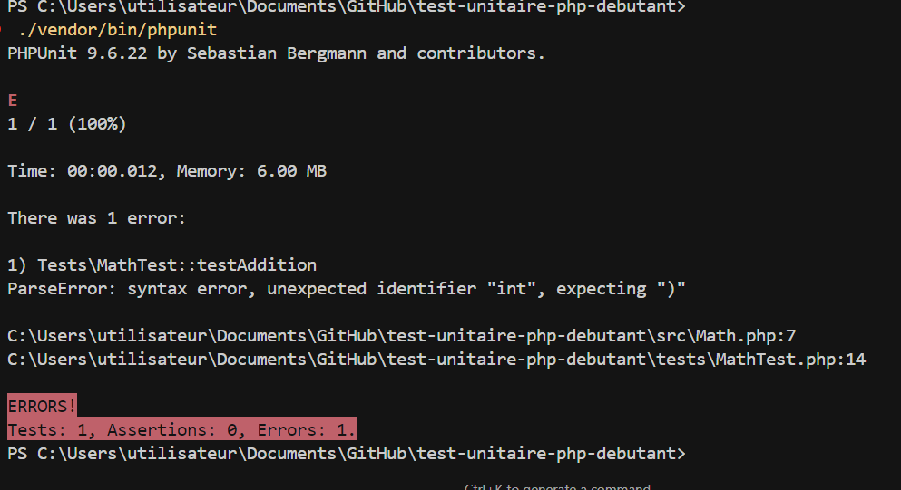

# Test Unitaire PHP pour Débutants

Ce projet est conçu pour apprendre et pratiquer les tests unitaires en PHP.

## Installation

Le projet utilise [Composer](https://getcomposer.org/) pour la gestion des dépendances.

1. Clonez le dépôt :
```bash
git clone https://github.com/votre-username/test-unitaire-php-debutant.git
cd test-unitaire-php-debutant
```

2. Installez les dépendances :
```bash
composer install
```

## Structure du Projet

- `src/` : Contient le code source de l'application
  - `Math.php` : Classe de base avec des opérations mathématiques
- `tests/` : Contient les tests unitaires
  - `MathTest.php` : Tests pour la classe Math
- `vendor/` : Contient les dépendances (généré par Composer)
- `composer.json` : Configuration du projet et ses dépendances
- `composer.lock` : Verrouille les versions exactes des dépendances
- `phpunit.xml` : Configuration de PHPUnit

## Configuration

Le projet est configuré avec :
- PHP 7.4 ou supérieur
- PHPUnit 9.5 pour les tests unitaires
- Autoloading PSR-4 pour les namespaces :
  - `App\` pour le code source
  - `Tests\` pour les tests

### Configuration de PHPUnit

Le fichier `phpunit.xml` configure :
- L'autoloading via Composer
- Le répertoire des tests (`./tests`)
- La couverture de code (`./src`)
- Les rapports de test en couleur


Les tests doivent être placés dans le dossier `tests/` et suivre la convention de nommage `*Test.php`.

## Exemple de Test

Le projet inclut un exemple simple avec la classe `Math` qui démontre les concepts de base des tests unitaires :





## Exécution des Tests

Pour exécuter les tests, vous avez deux options :
```bash
./vendor/bin/phpunit
# ou
composer test




```

### Tester les erreurs

Dans ma méthode, je retire une virgule pour créer une erreur lors du test:





